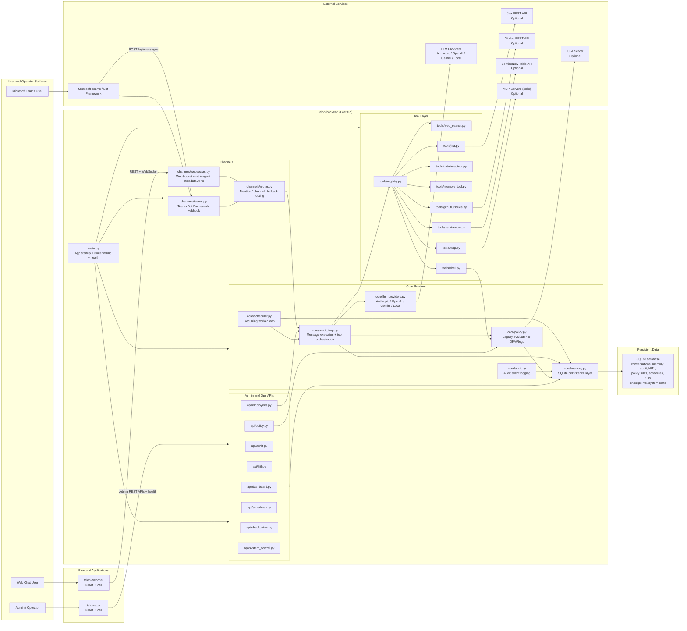
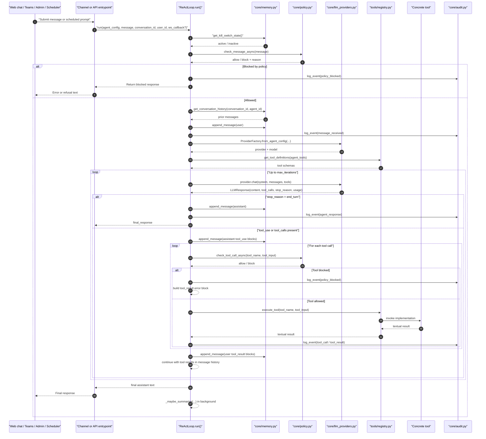
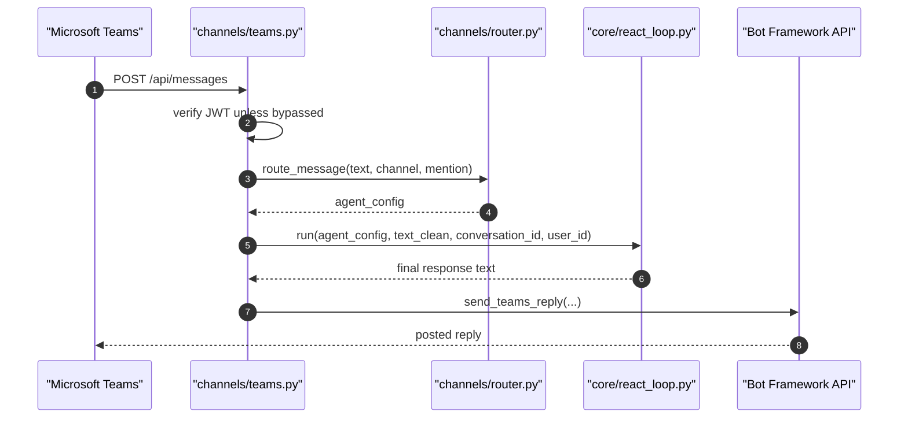
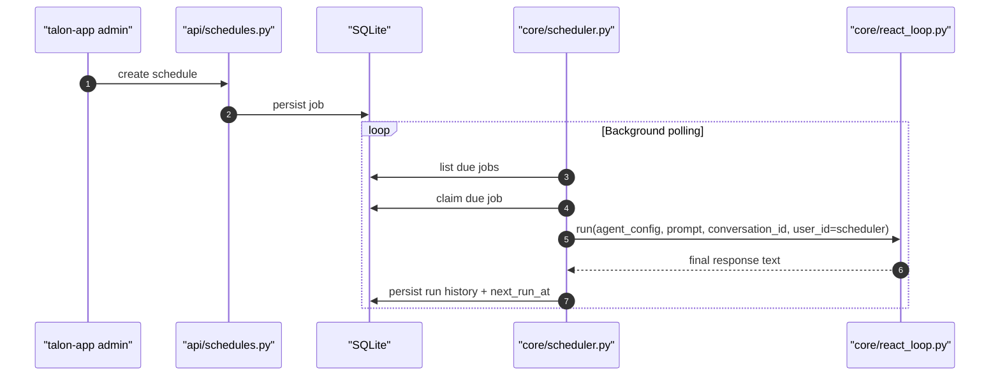
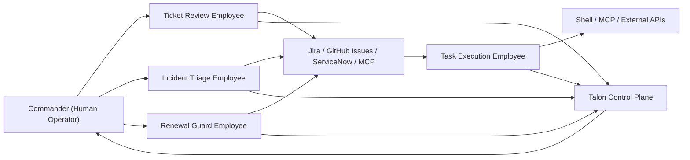

# Project Talon Detailed Design

This document describes the current implemented design of Project Talon as it exists in the repository today.

It covers:

- system purpose and scope
- backend and frontend architecture
- runtime request flows
- commander-led multi-agent operating model
- policy, scheduling, checkpoint, and control-plane behavior
- persistence model
- integration model for Teams, Jira, GitHub Issues, ServiceNow, MCP, and OPA
- deployment shape and remaining limitations

## 1. System Overview

Project Talon is an agent platform with three primary surfaces:

- `talon-backend`: the FastAPI backend and core execution engine
- `talon-webchat`: the user-facing real-time chat client
- `talon-app`: the admin/control-plane application

The backend hosts:

- REST APIs
- a WebSocket chat endpoint
- a Microsoft Teams webhook
- the ReAct execution loop
- provider abstraction for multiple LLM vendors
- tool execution
- long-term memory and audit persistence
- HITL workflow
- recurring scheduling
- checkpoints and rollback
- a global kill switch
- policy evaluation, including optional OPA/Rego mode

## 2. Design Goals

The implemented design optimizes for:

- multi-channel agent access through web chat and Teams
- provider-agnostic LLM execution
- auditable, persisted agent operations
- operator controls for safety and governance
- optional external integrations without forcing them on every deployment
- simple single-instance deployment on Render

## 3. High-Level Architecture



## 4. Backend Architecture

### 4.1 Application Startup

`talon-backend/main.py` is the runtime entrypoint. Startup performs:

1. environment loading
2. logging configuration
3. database path setup
4. SQLite initialization
5. policy rule seeding and cache refresh
6. MCP tool discovery from configured stdio servers
7. agent config loading from `config/agents.yaml`
8. integration status checks
9. scheduler startup

The app also exposes `/api/health`, which reports:

- provider availability
- kill switch state
- policy engine status
- Teams integration status
- Jira integration status
- GitHub Issues integration status
- ServiceNow integration status
- MCP integration status
- WebSocket connection count

### 4.2 Channel Layer

The channel layer provides multiple entrypoints into the same agent runtime.

#### Web chat

`channels/websocket.py` provides:

- `GET /api/agents`
- `GET /api/agents/{id}`
- `GET /api/chat/{id}/history/{session}`
- `WS /ws/chat/{agent_id}/{session_id}`

Web chat sessions stream:

- welcome
- typing
- tool call
- tool result
- final agent message
- error

#### Microsoft Teams

`channels/teams.py` provides:

- `POST /api/messages`

Teams messages:

- validate Bot Framework JWTs unless local bypass is enabled
- route by mention or channel
- execute through the same ReAct loop as web chat
- return replies via the Bot Framework API

#### Message routing

`channels/router.py` is the shared routing layer used by Teams and other channel-like entrypoints.

It supports:

- explicit mention routing
- channel-based routing
- fallback/default routing

### 4.3 ReAct Runtime

`core/react_loop.py` is the central execution engine.

Responsibilities:

- gate execution through kill-switch and policy checks
- load prior conversation history
- append new user messages
- invoke the configured LLM provider
- execute tool calls through the tool registry
- feed tool results back into the loop
- persist assistant responses
- emit audit events
- optionally stream events back to a WebSocket client

The loop is shared by:

- web chat
- Teams
- direct admin test messages
- scheduler-triggered runs

The concrete implementation entrypoint is `ReActLoop.run(...)`. The runtime
pattern is:

1. read the kill-switch state from `core/memory.py`
2. evaluate the inbound message with `core/policy.py`
3. load prior conversation history from `core/memory.py`
4. persist the new user message and audit the inbound event
5. resolve the provider and model through `ProviderFactory.from_agent_config(...)`
6. build the tool schema list through `tools/registry.py`
7. call `provider.chat(...)`
8. if the provider ends the turn, persist and return the assistant response
9. if the provider requests tools, persist the assistant tool-use blocks, execute tools, append `tool_result` blocks, and call the provider again
10. after completion, trigger background summarisation for episodic memory

Internally, Talon stores conversation history in Anthropic-style content-block
format even when the active provider is OpenAI-compatible, Gemini, or a local
OpenAI-style model. This is why `core/react_loop.py` converts responses into a
shared content-block format before writing them to SQLite.

#### ReAct Execution Sequence



#### WebSocket Streaming Behavior

When the caller is `channels/websocket.py`, the entrypoint passes a
`ws_callback` into `ReActLoop.run(...)`. That callback is used to emit:

- `typing` before the first provider call
- `tool_call` before each tool executes
- `tool_result` after each tool returns
- `error` if the provider or runtime fails

The final chat message is then sent by `channels/websocket.py` after
`ReActLoop.run(...)` returns. Teams and scheduler executions do not use this
incremental streaming path.

### 4.4 Provider Layer

`core/llm_providers.py` abstracts provider-specific behavior behind a shared interface.

Supported providers:

- Anthropic
- OpenAI-compatible APIs
- Google Gemini
- local OpenAI-compatible endpoints

This lets each agent choose its own provider and model through `config/agents.yaml`.

### 4.5 Policy Layer

`core/policy.py` supports two modes:

- `legacy`: in-process evaluation using persisted regex-based rules
- `opa`: OPA/Rego evaluation through an external OPA server

The current design keeps policy rules persisted in SQLite and admin-manageable through the Talon control plane. When OPA mode is enabled:

- rules are synced into OPA data
- Talon loads a Rego decision module
- message, shell, and tool-call checks go through OPA
- fail-open vs fail-closed behavior is controlled by `OPA_FAIL_MODE`

Policy decisions currently gate:

- inbound messages
- shell commands
- tool calls

### 4.6 Scheduling

`core/scheduler.py` runs as a background worker inside the backend process.

Responsibilities:

- poll for due scheduled jobs
- claim jobs to avoid duplicate concurrent execution in the current single-instance design
- skip work if the kill switch is active
- skip work if the target agent is paused
- execute the scheduled prompt through the ReAct loop
- persist run history and next-run timestamps
- emit audit events

### 4.7 Audit Layer

`core/audit.py` records major system and agent events, including:

- messages received
- responses generated
- tool calls
- policy blocks
- admin control actions
- scheduler activity
- checkpoint activity
- kill-switch changes

Audit data is exposed through admin APIs and displayed in the admin app.

## 5. Tool Architecture

`tools/registry.py` is the dispatch layer between the ReAct loop and concrete tools.

Implemented tools:

- `web_search`
- `shell_exec`
- `datetime`
- `memory_recall`
- `memory_store`
- `jira_get_issue`
- `jira_search`
- `jira_create_issue`
- `github_get_issue`
- `github_search_issues`
- `github_create_issue`
- `servicenow_get_ticket`
- `servicenow_search_tickets`
- `servicenow_create_ticket`
- dynamically discovered MCP tools

### 5.1 Jira Integration

`tools/jira.py` supports:

- `disabled`
- `mock`
- `live`

Live mode requires:

- `JIRA_BASE_URL`
- `JIRA_EMAIL`
- `JIRA_API_TOKEN`

### 5.2 GitHub Issues Integration

`tools/github_issues.py` supports:

- `disabled`
- `mock`
- `live`

Live mode requires:

- `GITHUB_TOKEN`
- `GITHUB_REPO`

The current implementation supports:

- get issue by number
- search issues
- create issue

### 5.3 ServiceNow Integration

`tools/servicenow.py` supports:

- `disabled`
- `mock`
- `live`

Live mode requires:

- `SERVICENOW_BASE_URL`
- `SERVICENOW_USERNAME`
- `SERVICENOW_PASSWORD`

Optional configuration:

- `SERVICENOW_TABLE` with a default of `incident`

The current implementation supports:

- get ticket by number
- search tickets using `sysparm_query`
- create tickets through the Table API

### 5.4 MCP Integration

`tools/mcp.py` supports:

- startup-time discovery of stdio MCP servers configured through `MCP_SERVERS_JSON`
- `tools/list` discovery and schema adaptation into Talon's native tool registry
- `tools/call` execution through the same ReAct and policy path as native tools
- operator-visible health reporting through `/api/health`

Agent tool grants can use:

- `mcp:*`
- `mcp:<server>:*`
- `mcp:<server>:<tool>`

The current implementation keeps MCP as a dynamic tool source rather than a separate execution subsystem. That means MCP tools still pass through the registry, policy checks, audit flow, and agent-level tool allowlists.

### 5.5 Shell Tool

`tools/shell.py` provides a bounded shell execution capability.

Safety model:

- allowlist of common commands
- policy-based blocking before execution
- timeout enforcement
- output truncation

## 6. Admin and Control Plane APIs

The backend exposes several admin-only API groups:

- `api/dashboard.py`
- `api/employees.py`
- `api/audit.py`
- `api/hitl.py`
- `api/policy.py`
- `api/schedules.py`
- `api/checkpoints.py`
- `api/system_control.py`

These are protected by `api/admin_auth.py` and the `ADMIN_API_TOKEN`.

Capabilities exposed through these APIs include:

- employee inventory and stats
- pause/resume
- direct agent test messages
- audit inspection
- HITL create/approve/reject
- policy rule listing, toggle, upsert, status, sync
- scheduled job create/pause/resume/run-now/history
- checkpoint create/list/restore
- global kill switch get/set

## 7. Frontend Architecture

### 7.1 Web Chat

`talon-webchat` is the end-user chat application.

Key responsibilities:

- agent selection
- backend connection setup
- session persistence per agent
- live WebSocket chat
- rendering streamed tool events and markdown messages

### 7.2 Admin Console

`talon-app` is the operator-facing control plane.

Key responsibilities:

- load backend metrics and inventory
- display health and audit state
- manage pause/resume
- manage HITL workflow
- manage policy rules
- manage schedules
- manage checkpoints and rollback
- manage the global kill switch

The frontend reads its state from backend APIs rather than mock data.

## 8. Persistence Model

The persistence layer is implemented in `core/memory.py`.

Major persisted entities include:

- conversation messages
- episodic memory
- entity memory
- agent status
- audit events
- HITL requests
- policy rules
- scheduled jobs
- scheduled job runs
- agent checkpoints
- system state, including kill switch

Current database:

- SQLite

Current design assumption:

- single backend instance with one attached persistent disk

## 9. Runtime Flows

### 9.1 Web Chat Request Flow

1. user selects agent in `talon-webchat`
2. client opens `WS /ws/chat/{agent_id}/{session_id}`
3. user sends a message event
4. backend checks kill switch and agent status
5. backend runs policy checks
6. ReAct loop loads memory and calls the provider
7. tool calls are executed through the registry as needed
8. tool results are streamed back to the client
9. final response is persisted and streamed back
10. audit entries are written throughout

```mermaid
sequenceDiagram
    autonumber
    participant Browser as "talon-webchat"
    participant WS as "channels/websocket.py"
    participant Loop1 as "core/react_loop.py"
    participant Registry as "tools/registry.py"
    participant Provider as "LLM provider"
    participant DB as "SQLite"

    Browser->>WS: Connect WS /ws/chat/{agent_id}/{session_id}
    WS-->>Browser: welcome
    Browser->>WS: {type: message, text, user}
    WS->>Loop1: run(..., ws_callback)
    Loop1-->>Browser: typing
    Loop1->>DB: load history + append user message
    Loop1->>Provider: chat(messages, tools)
    alt Tool use
        Loop1-->>Browser: tool_call
        Loop->>Registry: execute_tool(...)
        Registry-->>Loop1: tool result
        Loop1-->>Browser: tool_result
        Loop1->>Provider: chat(updated messages, tools)
    end
    Loop1->>DB: append assistant message + audit
    Loop1-->>WS: final response text
    WS-->>Browser: {type: message, text, agent, agent_id}
```

### 9.2 Teams Request Flow

1. Teams sends an activity to `POST /api/messages`
2. Talon validates the Bot Framework token
3. mention/channel routing selects an agent
4. kill switch and paused-agent gates are applied
5. ReAct loop runs
6. Talon replies through the Bot Framework API
7. audit events are recorded



### 9.3 Scheduled Job Flow

1. admin creates a scheduled job
2. scheduler loop polls for due jobs
3. due job is claimed
4. kill switch and paused-agent gates are applied
5. prompt is executed through the ReAct loop
6. run history and next-run time are persisted
7. audit events are recorded



### 9.4 Policy Evaluation Flow

1. runtime creates a policy input for message, shell, or tool scope
2. if `POLICY_ENGINE=legacy`, Talon evaluates locally
3. if `POLICY_ENGINE=opa`, Talon calls OPA with the policy input
4. blocked decisions return a reason string
5. blocked actions are audit-logged

## 10. Commander-Led Multi-Agent Operating Model

The next target operating model for Talon is a commander-led workflow where a human operator directs multiple specialized digital employees.

### 10.1 Target Roles

The concrete target design is:

- `Commander`
  The human operator using `talon-app`, `talon-webchat`, or Teams to initiate work, review decisions, approve risky actions, and monitor progress.

- `Ticket Review Employee`
  Reviews incoming request tickets, extracts intent and scope, and creates structured execution tasks in Jira, GitHub Issues, ServiceNow, or another MCP-backed work system.

- `Task Execution Employee`
  Reviews queued tasks, executes approved work using Talon tools such as shell, GitHub Issues, ServiceNow, or MCP-backed infrastructure tools, and records outcomes.

- `Incident Triage Employee`
  Watches incident sources, classifies severity, opens or updates tickets, routes incidents to the right employee, and escalates to the commander when risk thresholds are exceeded.

- `Renewal Guard Employee`
  Watches password, certificate, token, and secret expiry dates; creates or executes renewal work; and escalates when renewal cannot be safely automated.

### 10.2 Workflow Shape



### 10.3 Expected Capabilities Per Employee

#### Ticket Review Employee

Expected tools:

- Jira or GitHub Issues or ServiceNow
- memory recall/store
- optional MCP tools for internal ticket/context systems

Expected behavior:

- read a request ticket
- summarize intent, impact, and constraints
- decompose work into actionable tasks
- create or update work items
- flag risky or ambiguous tickets for HITL approval

#### Task Execution Employee

Expected tools:

- shell execution
- GitHub Issues or GitHub PR tooling in the future
- ServiceNow or Jira for status updates
- MCP tools for infrastructure or internal systems

Expected behavior:

- pick up approved tasks
- validate prerequisites and policy constraints
- execute bounded remediation or operational steps
- update task status and attach results
- request HITL approval when execution crosses risk thresholds

#### Incident Triage Employee

Expected tools:

- monitoring or incident-source integrations, likely via MCP or future native tools
- ticketing tools
- memory recall/store

Expected behavior:

- poll or receive incident signals
- classify severity and probable owner
- correlate incidents with known tasks or prior incidents
- create/update incident tickets
- escalate high-risk incidents to the commander

#### Renewal Guard Employee

Expected tools:

- certificate, password, secret, and token inventory integrations, likely via MCP or future native tools
- ticketing tools
- optional shell or API tools for approved renewals

Expected behavior:

- watch expiry windows
- generate renewal tasks before deadline
- execute safe automated renewals where allowed
- escalate manual renewals or failed renewals

### 10.4 Current Fit Versus Target State

What Talon already supports for this model:

- multiple specialized employees with different tool grants
- scheduling for recurring review/polling jobs
- HITL approval for risky operations
- policy enforcement for messages, shell, and tool calls
- checkpointing, rollback, kill switch, and audit logging
- ticketing integrations for Jira, GitHub Issues, and ServiceNow
- MCP as an extensibility layer for additional enterprise systems

What is still missing to make this model fully real:

- first-class agent-to-agent orchestration and delegation
- a persisted task queue and handoff model between employees
- incident-source integrations beyond current generic tooling
- expiry/renewal integrations for passwords, certificates, and secrets
- richer operator modes for supervised execution and tool-restricted runs

### 10.5 Recommended Agent Configuration Pattern

The recommended future agent set is:

- `commander-console`
  Human-facing orchestration surface rather than a fully autonomous agent.

- `riley-ticket-review`
  Ticket intake and task decomposition.

- `quinn-task-exec`
  Approved task execution and task-state updates.

- `sasha-incident-triage`
  Incident watch, correlation, triage, and escalation.

- `avery-renewal-guard`
  Expiry watch, renewal planning, and controlled renewal execution.

These should be treated as separate agents with different tool grants, policy scopes, scheduler jobs, and HITL thresholds rather than one general-purpose operator bot.

## 11. Deployment Architecture

The repository is currently designed for Render deployment:

- backend as a Python web service
- web chat as a static site
- persistent disk for SQLite

Key deployment characteristics:

- health-checked backend
- static SPA route rewrite for web chat
- environment-driven optional integrations
- single-instance persistence model

## 12. Security and Governance Controls

Implemented controls:

- admin token protection on control-plane APIs
- explicit CORS configuration
- Teams webhook JWT validation
- optional OPA/Rego policy evaluation
- shell command gating
- HITL workflow
- checkpointing and rollback
- global kill switch
- audit logging

## 13. Known Limitations

The current design is functional but not fully mature in a few areas.

### 13.1 Persistence Scale

SQLite is still the primary datastore. This limits:

- horizontal scaling
- HA topologies
- operational backup/migration maturity

### 13.2 Observability Depth

The system exposes health, audit, and operator data, but it does not yet expose rich time-series telemetry for:

- token usage
- latency
- cost
- provider throughput
- tool metrics

### 13.3 Operator Mode Depth

Pause/resume and kill switch are implemented, but advanced operating modes are still limited.

### 13.4 Commander Workflow Gaps

The commander-led multi-agent design is only partially implemented today.

Current gaps include:

- no built-in task handoff queue between digital employees
- no first-class delegation model where one employee assigns work to another
- no native incident ingestion integrations such as PagerDuty, Sentry, or monitoring platforms
- no native expiry-watch and renewal integrations for certificates, passwords, and secrets

## 14. Recommended Next Technical Steps

1. Replace SQLite with a multi-instance-safe datastore such as Postgres.
2. Add migration and backup/restore operations for persistence.
3. Expand observability APIs with real time-series metrics.
4. Add deeper operator modes such as read-only and supervised execution.
5. Add first-class commander workflow primitives: task handoff, agent delegation, and execution-state tracking.
6. Add incident-source and renewal-source integrations using MCP or native tools.
7. Broaden end-to-end automated verification across web chat, admin flows, Teams, Jira, GitHub Issues, ServiceNow, MCP, and OPA.
